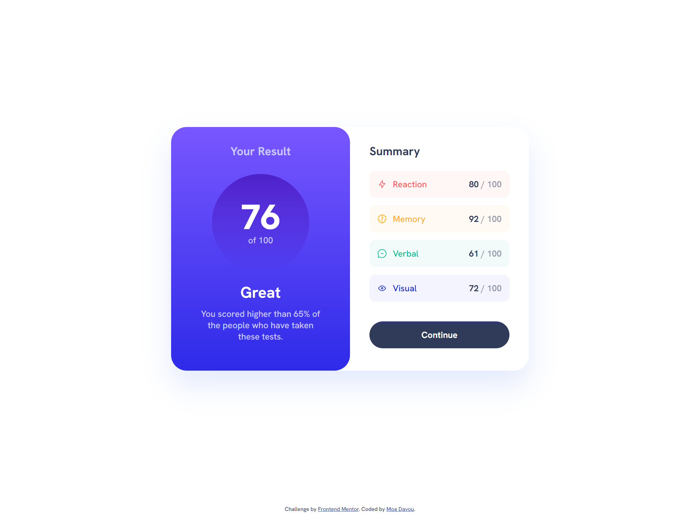

# Frontend Mentor - Results summary component solution

This is a solution to the [Results summary component challenge on Frontend Mentor](https://www.frontendmentor.io/challenges/results-summary-component-CE_K6s0maV). Frontend Mentor challenges help you improve your coding skills by building realistic projects.

## Table of contents

-   [Overview](#overview)
    -   [The challenge](#the-challenge)
    -   [Screenshot](#screenshot)
    -   [Links](#links)
-   [Setup & Usage](#setup--usage)
-   [My process](#my-process)
    -   [Built with](#built-with)
    -   [What I learned](#what-i-learned)
    -   [Continued development](#continued-development)
-   [Author](#author)

## Overview

### The challenge

Users should be able to:

-   View the optimal layout for the interface depending on their device's screen size
-   See hover and focus states for all interactive elements on the page
-   **Bonus**: Use the local JSON data to dynamically populate the content

### Screenshot

### Links

-   Repository URL: [GitHub](https://github.com/moadavou/results-summary-component)
-   Live Site URL: [GitHub Pages](https://moadavou.github.io/results-summary-component/)

## Setup & Usage

After you clone this repo to your desktop, go to its root directory and run `npm install` to install its dependencies.

Once the dependencies have been installed, you can run `npm start` to access the website's live server in your browser. You will then be able to access it at [localhost:3000](http://localhost:3000).

When the project is ready for deployment, run `npm run build` to compile the scss and sass files to css, minimize, autoprefix, and purge unwanted classes.

## My process

### Built with

-   Semantic HTML5 markup
-   CSS custom properties
-   Flexbox
-   CSS Grid
-   Mobile-first workflow

*   [Sass](https://sass-lang.com/) _(v1.77.2)_ - CSS pre-processor

### What I learned

I learned how to use local JSON data to dynamically populate website content. I used the `fetch()` API along with the `innerHTML` property to achieve this. Additionally, I performed a calculation for the total score and made it update dynamically in the HTML based on the JSON data.

If this were a real project, I would have included a method to dynamically calculate the ranking of the results. I considered adding it, but I chose not to because I didn't want to allocate time to create text content for it.

In addition, I learned different methods for creating transitions using the 'background-image' property, which enabled me to create transitions with gradients.

### Continued development

I'm not sure if my method of using local JSON data to dynamically populate website content was the most optimal. I would like to learn more about this, as well as improve my knowledge of API, DOM manipulation, and JavaScript.

## Author

-   Frontend Mentor - [@moadavou](https://www.frontendmentor.io/profile/moadavou)
-   LinkedIn - [@moadavou](https://www.linkedin.com/in/moadavou/)
